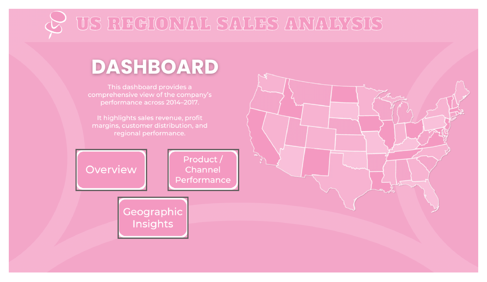

# Sales Performance Dashboard

## 📊 Project Overview
This project presents an interactive **Sales Performance Dashboard** built with **Power BI**.  
The dashboard provides insights into sales, revenue, profit, and customer behavior to help decision-makers monitor performance and identify trends.

---

## 🚀 Features
- **Revenue & Profit Analysis**: Track total revenue, profit, and profit margin.  
- **Top/Bottom 5 Analysis**: Easily switch between top and bottom performers.  
- **Customer Summary**: View order count, revenue, and profitability by customer.  
- **Monthly Trends**: Visualize revenue and profit across months in correct order (Jan → Dec).  
- **Q&A Section**: Ask natural language questions (e.g., *"Which month had the highest revenue?"*).  
- **Bins & Distribution**: Order value distribution grouped into dynamic bins.  

---

## 🛠️ Tech Stack
- **Power BI Desktop**  
- **DAX (Data Analysis Expressions)**  
- **SQL (Data Preparation)**  
- **Python (Data Cleaning & Preprocessing)**  

---

## 📂 Dataset
The dataset contains order-level sales records with the following key fields:
- `order_number`, `order_date`, `customer_name`, `channel`, `product_name`
- `quantity`, `unit_price`, `revenue`, `cost`, `profit`, `profit_margin_pct`
- `state`, `us_region`, `order_month_num`, `order_month_name`

*(Sensitive or proprietary data has been replaced with a sample dataset.)*

---

## 📸 Dashboard Preview
> 

---

## 🔮 Future Improvements
- Adding predictive analysis (forecasting revenue & profit).  
- Drill-through reports for product-level deep dives.  
- Enhanced customer segmentation.  

---

## 📥 How to Use
1. Clone the repository:  
   ```bash
   git clone https://github.com/yourusername/sales-dashboard.git
